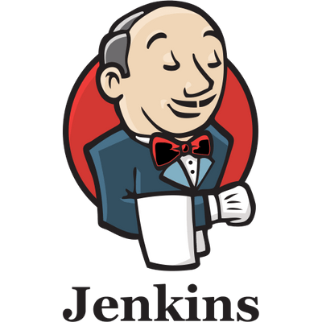
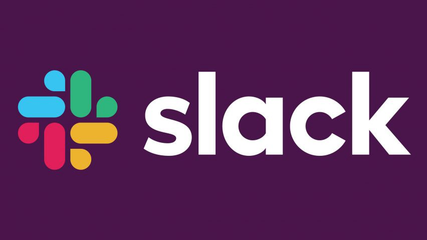
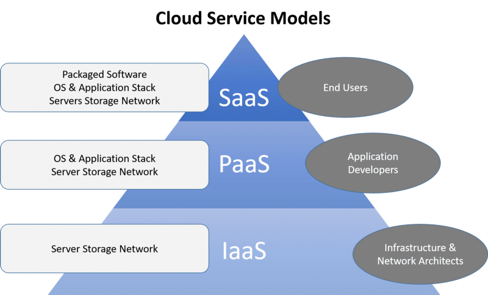

# DevOps-Summary

## Benefits to a business

Technical benefits:

- Continous software delivery
- Less complexity to manage
- Faster resolution of problems

Cultural Benefits:

- Happier and more productive teams
- Higher employee engagement
- Greater professional development opportunities

Business Benefits:

- Faster delivery of features
- More stable operating environments
- Improved communication and collaboration
- More time to innovate

## DevOps tools

Some of the most popular tools used:

name | use | logo
-|-|-
Git | Version control and code deployement tool | 
Gradle | Build tool | 
Jenkins | CD/CI tool | 
Docker | Containerization tool | 
Ansible | Configuration management tool | 
Slack | Communication tool | 

## Cloud computing

Cloud computing consists of renting a remote computer such as Azure, for the need of computing power. This includes services such as servers, storage, databases, networking etc.

Cloud computing is a good way of off loading onprem development and move all the computational power to the cloud.

This allows companies to reduce expenses of purchasing computing power to perform a project and instead only rent a computer as per needed basis.

### SaaS

SaaS stands for Software as a Service. This type of cloud computing delivers applications over the internet through the browser. Example of this is Office 365. Typical SaaS application offer extensive configuration options as well as development environments that enable customers to code their own modifications and additions.

### IaaS

IaaS stands for Infrastructure as a Service. This type of cloud computing offers storage and compute services on pay-per-use basis. Example of this is Virtual Private Networks, Highly Scalable Databases, Machine learning etc.

### PaaS

PaaS stands for Platform as a Service. This type of cloud computing is specifically targetted at developers who can use shared tools processes and APIs to accelerate the development, testing and deployment of applications.

### FaaS

FaaS stands for Functions as a Service. This type of cloud computing is a version of a serverless computing, that adds another layer of abstraction to PaaS. This allows developers to be completely insulated from everything in the stack below their code.

## Definitions

- onprem => On-premises is installed and runs on a computer on the premises of the organisation
- localhost => Local machine (currently used computer)
- hybrid => allows small business software applications that run on their own internal desktop and servers to applications that run in the cloud
- public cloud => type of computing that makes resources available to public via internet

